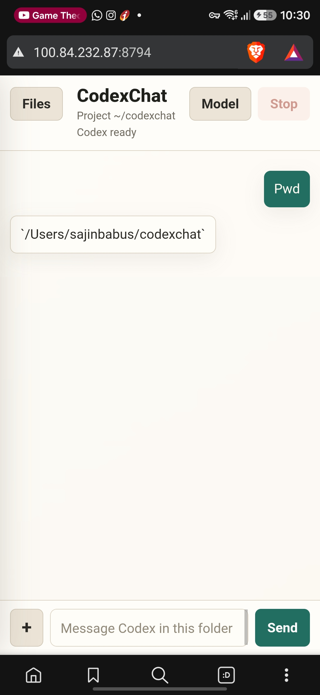
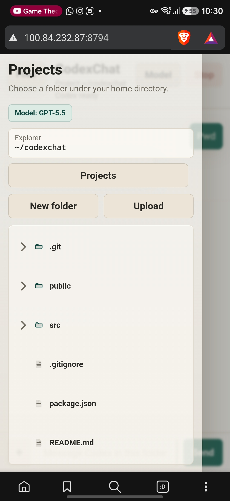
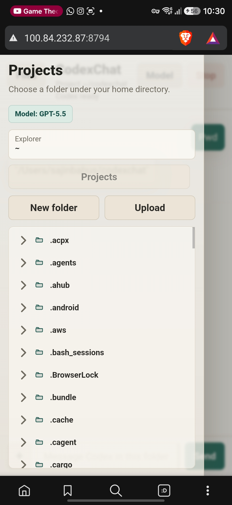
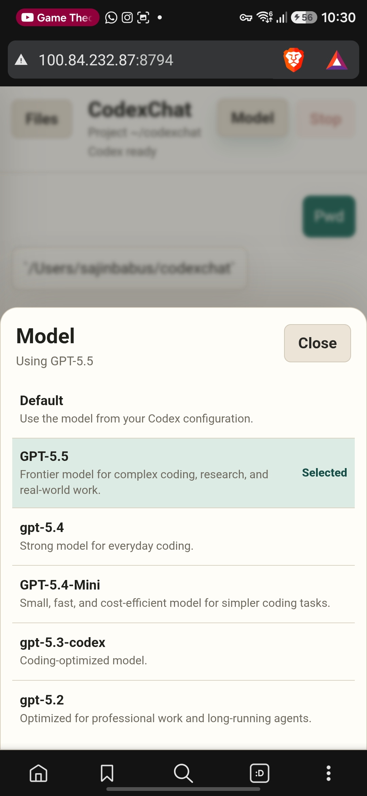
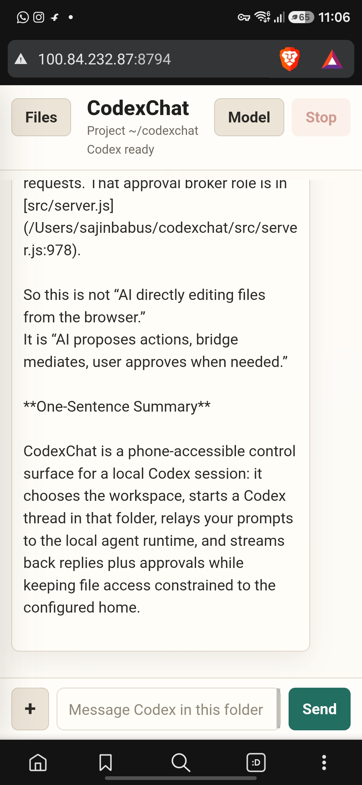

# CodexChat

> A local web interface for controlling Codex AI from any device on your network


CodexChat is a private, local web application that lets you control [OpenAI Codex](https://docs.sourcegraph.com/codex) from your phone, tablet, or another computer on the same network. Browse projects, chat with Codex, approve tool requests, and edit files—all from a clean browser interface.

**⚠️ Security Notice:** This app has no authentication. Only use on trusted private networks. See [Security](#security) for details.

---

## Features

### 📁 File Explorer
- Browse your home directory or a restricted `CODEXCHAT_HOME` folder
- Create folders, upload files, and navigate with an intuitive tree view
- Open text files in editable tabs directly in the browser

### 💬 Chat Interface
- Send messages to Codex and receive streamed responses
- Approve or deny tool requests (read, write, execute commands) with one click
- Support for multiple GPT models (GPT-5.5, GPT-5.4, GPT-5.4 Mini, GPT-5.3 Codex, GPT-5.2)
- Slash commands: `/model`, `/review`, `/compact`

### 📎 Attachments
- Attach files from the explorer to your messages
- Capture photos directly from your device camera
- Files are uploaded to the active Codex workspace folder

### 📱 Cross-Device
- Access from any device on your local network
- Works great with tablets and phones
- Optional Tailscale support for remote access

---

## Screenshots

| Active Chat | Project Drawer | Home Drawer |
|:-----------:|:--------------:|:-----------:|
|  |  |  |

| Model Picker | Chat Response |
|:------------:|:-------------:|
|  |  |

---

## Requirements

| Requirement | Version | Notes |
|-------------|---------|-------|
| **Node.js** | ≥ 20 | Required to run the server |
| **Codex CLI** | Latest | Must be installed and on PATH |
| **macOS** | Any | Primary platform; other Unix-like OSes may work |
| **Network** | Local Wi-Fi or Tailscale | For cross-device access |

### Codex Installation

```bash
# Install Codex CLI (from OpenAI)
npm install -g @openai/codex

# Verify installation
codex --version
```

---

## Quick Start

### 1. Clone and Install

```bash
cd /Users/sajinbabus/codexchat
npm install
```

### 2. Start the Server

```bash
npm run dev
```

The server will print URLs for local and network access:

```
┌─────────────────────────────────────────────────┐
│  CodexChat is running!                          │
│                                                 │
│  Mac:      http://localhost:8787               │
│  Network:  http://192.168.1.25:8787              │
│                                                 │
│  Press Ctrl+C to stop                            │
└─────────────────────────────────────────────────┘
```

### 3. Connect

- **On your Mac:** Open `http://localhost:8787`
- **On another device:** Open the `Network:` URL shown above

### 4. Start Chatting

1. Select a project folder in the left sidebar
2. Type a message and send it
3. Approve any tool requests that appear

---

## Configuration

### Environment Variables

| Variable | Default | Description |
|----------|---------|-------------|
| `CODEXCHAT_HOME` | `~` | Root folder for file browsing |
| `PORT` | `8787` | Server port |
| `HOST` | `0.0.0.0` | Bind address (`127.0.0.1` for Mac-only) |
| `CODEXCHAT_FILE_PREVIEW_LIMIT` | `1048576` (1MB) | Max file size for browser editing |
| `CODEXCHAT_UPLOAD_LIMIT` | `52428800` (50MB) | Max upload size |
| `CODEX_HOME` | `~/.codex` | Codex configuration directory |

### Examples

```bash
# Restrict to a specific project folder
CODEXCHAT_HOME=/Users/you/projects npm run dev

# Use a different port
PORT=8794 npm run dev

# Mac-only access (no network)
HOST=127.0.0.1 npm run dev

# Combined example
CODEXCHAT_HOME=/Users/you/work PORT=9000 npm run dev
```

---

## Remote Access with Tailscale

When your devices aren't on the same Wi-Fi, use [Tailscale](https://tailscale.com/):

1. **Install Tailscale** on both your Mac and phone/tablet
2. **Sign in** to the same Tailscale account on both devices
3. **Start CodexChat:**
   ```bash
   npm run dev
   ```
4. **Get your Mac's Tailscale IP:**
   ```bash
   tailscale ip -4
   ```
5. **Open from your other device:**
   ```
   http://<your-mac-tailscale-ip>:8787
   ```

---

## File Management

### Two Upload Destinations

| Action | Destination | Usage |
|--------|-------------|-------|
| **Explorer Upload** | Currently shown folder | Add files to the browser's visible directory |
| **Chat Attachment** | Active Codex project | Include files in your message to Codex |

### In-Browser Editing

- Text files under 1MB can be opened and edited directly
- Binary files and large files are view-only
- Save changes with the `Save` button
- Download files using the `Download` button

### File Size Limits

```bash
# Edit text files up to 2MB
CODEXCHAT_FILE_PREVIEW_LIMIT=2097152 npm run dev

# Upload files up to 100MB
CODEXCHAT_UPLOAD_LIMIT=104857600 npm run dev
```

---

## Security

> **⚠️ Important:** This application has no authentication. Anyone who can reach it on your network can browse, upload, download, edit files, and interact with Codex.

### Recommendations

1. **Use on private networks only** — Never expose to the public internet
2. **Restrict file access** — Set `CODEXCHAT_HOME` to limit browsing scope
3. **Prefer Tailscale** — Provides encrypted access without opening router ports
4. **Use localhost when alone** — Set `HOST=127.0.0.1` for single-device use

### Trusted Network Checklist

- [ ] Mac and phone/tablet on same trusted Wi-Fi
- [ ] macOS firewall allows Node.js incoming connections
- [ ] No exposed ports on router (or use Tailscale)

---

## Troubleshooting

### Server Won't Start

```bash
# Check if port is in use
lsof -i :8787

# Try a different port
PORT=8788 npm run dev
```

### Browser Can't Connect

```bash
# Verify server is running
curl http://localhost:8787/api/health

# Check if it's listening on all interfaces
curl http://127.0.0.1:8787/api/health
```

### Codex Not Responding

1. Confirm Codex works in Terminal:
   ```bash
   codex --version
   ```
2. Select a project folder before sending a message
3. Refresh the page after restarting the server

### Wrong Upload Location

- Use **Explorer → Upload** for the currently browsed folder
- Use **Composer → + → File/Camera** for the active Codex project

### Syntax Check

```bash
node --check public/app.js
node --check src/server.js
```

---

## Architecture

```
codexchat/
├── public/
│   ├── index.html     # Main HTML structure
│   ├── app.js         # Frontend application
│   └── styles.css     # Styling
├── src/
│   └── server.js      # Node.js server (Express-like)
├── package.json
└── README.md
```

### Key Components

- **server.js** — HTTP server, file operations, Codex process spawning, API endpoints
- **app.js** — UI state management, SSE connection, DOM manipulation
- **styles.css** — Custom styling with warm paper tones

---

## Development

```bash
# Run development server
npm run dev

# Run production server
npm start

# Syntax check
node --check public/app.js && node --check src/server.js
```

---

## License

Private and internal use only. Not intended for public distribution.
